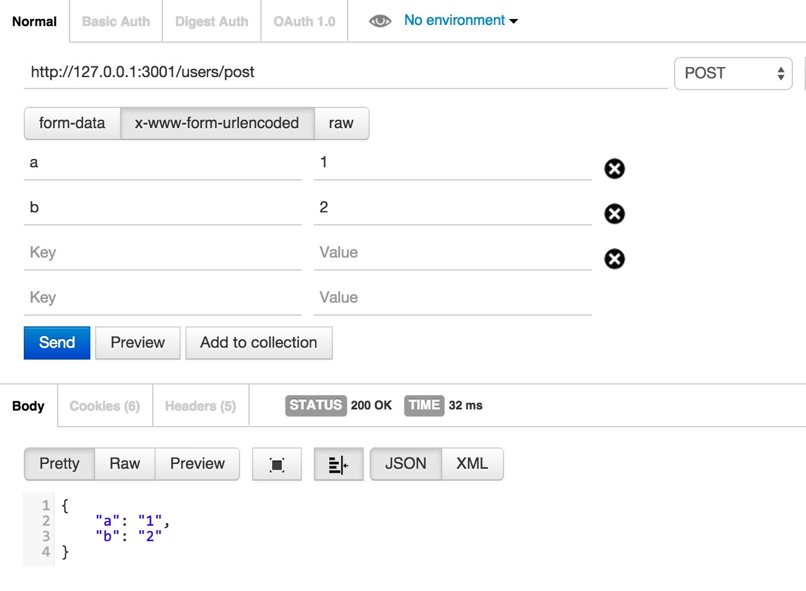
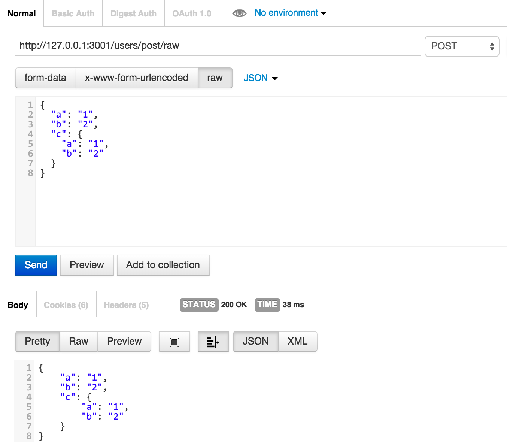

# node-http

## 绝对地址和相对地址

http://jingyan.baidu.com/article/9225544683537d851648f4e0.html


## querystring

http://zhidao.baidu.com/link?url=M9__pYJ44i4SvL8E_4o7tT9g_qhKuplPxmnl5-c8NOt-jApN6XSbQCfxCUXn_pDygPS2znebrpd-EwcPuc6J9a

## url 和 uri

http://www.cnblogs.com/gaojing/archive/2012/02/04/2413626.html

## http status code

https://github.com/nodejs/io.js/blob/master/lib/_http_server.js

## http verbs

http://www.w3.org/Protocols/rfc2616/rfc2616-sec9.html

## req取参数的3种方法

expressjs里的请求参数，4.x里只有3种

- req.params
- req.body
- req.query
- req.param(Deprecated. Use either req.params, req.body or req.query, as applicable.)


### req.params

```
app.get('/user/:id', function(req, res){
  res.send('user ' + req.params.id);
});
```

### req.body

Contains key-value pairs of data submitted in the request body. By default, it is undefined, and is populated when you use body-parsing middleware such as body-parser and multer.

This example shows how to use body-parsing middleware to populate req.body.

```
var app = require('express')();
var bodyParser = require('body-parser');
var multer = require('multer'); 

app.use(bodyParser.json()); // for parsing application/json
app.use(bodyParser.urlencoded({ extended: true })); // for parsing application/x-www-form-urlencoded
app.use(multer()); // for parsing multipart/form-data

app.post('/', function (req, res) {
  console.log(req.body);
  res.json(req.body);
})
```

可以肯定的一点是req.body一定是post请求，express里依赖的中间件必须有bodyParser，不然req.body是没有的。

详细的说明在下面的3种post用法里。

### req.query

说明req.query不一定是get

```
// GET /search?q=tobi+ferret
req.query.q
// => "tobi ferret"

// GET /shoes?order=desc&shoe[color]=blue&shoe[type]=converse
req.query.order
// => "desc"

req.query.shoe.color
// => "blue"

req.query.shoe.type
// => "converse"
```

因为有变态的写法

```
// POST /search?q=tobi+ferret
req.query.q
// => "tobi ferret"
```

## 准备工作

```
var app = express();
var multer  = require('multer')

// for raw data
app.use(function(req, res, next){
  if (req.is('text/*')) {
    req.text = '';
    req.setEncoding('utf8');
    req.on('data', function(chunk){ req.text += chunk });
    req.on('end', next);
  } else {
    next();
  }
});

app.use(multer({ 
	dest: './uploads/',
  rename: function (fieldname, filename) {
    return filename.replace(/\W+/g, '-').toLowerCase() + Date.now()
  }
}))
```

说明

- express4之后上传组件使用multer
- express4之前是由req.text的，但不知道是什么原因在4里取消了。

## 3种不同类型的post


```
var express = require('express');
var router = express.Router();

/* GET users listing. */
router.get('/', function(req, res) {
  res.send('respond with a resource');
});

router.get('/:id', function(req, res) {
  res.send('respond with a resource' + request.params.id);
});

router.post('/post', function(req, res) {
  // res.send('respond with a resource');
	res.json(req.body);
});

router.post('/post/formdata', function(req, res) {
  // res.send('respond with a resource');
	console.log(req.body, req.files);
	console.log(req.files.pic.path);
	res.json(req.body);
});

router.post('/post/raw', function(req, res) {
  // res.send('respond with a resource');
	res.json(req.text);
});


module.exports = router;
```


### Post with x-www-form-urlencoded

see post.html


```
	<script>
	$(function(){
		$.ajaxSetup({
		  contentType: "application/x-www-form-urlencoded; charset=utf-8"
		});
	
		$.post("/users/post", { name: "i5a6", time: "2pm" },
		   function(data){
		     console.log(data);
		   }, "json");
		 
	});
	</script>
```

in routes/users.js

```
	router.post('/post', function(req, res) {
	  // res.send('respond with a resource');
		res.json(req.body);
	});
```



### Post with form-data


	npm install --save multer


Usage

```
var express = require('express')
var multer  = require('multer')

var app = express()
app.use(multer({ dest: './uploads/'}))
```

You can access the fields and files in the request object:

```
console.log(req.body)
console.log(req.files)
```

IMPORTANT: Multer will not process any form which is not multipart/form-data

[see more](https://github.com/expressjs/multer)


### Post with raw


To get the raw body content of a request with Content-Type: "text/plain" into req.rawBody you can do:

https://gist.github.com/tj/3750227


req.rawBody已经被干掉了，现在只能用req.text

下面是tj给出的代码片段

```
var express = require('./')
var app = express();
 
app.use(function(req, res, next){
  if (req.is('text/*')) {
    req.text = '';
    req.setEncoding('utf8');
    req.on('data', function(chunk){ req.text += chunk });
    req.on('end', next);
  } else {
    next();
  }
});
 
app.post('/', function(req, res){
  res.send('got "' + req.text + '"');
});
 
app.listen(3000)
```



## 命令行玩法

```
#! /bin/bash

echo -n "post common"
curl -d "a=1&b=2" http://127.0.0.1:3001/users/post

echo -n 'post formdata'
curl -F 'pic=@"img/post-common.png"' -F 'a=1' -F 'b=2'  http://127.0.0.1:3001/users/post/formdata

echo -n 'post raw json'

curl -d "{"a":"1","b":"2","c":{"a":"1","b":"2"}}" http://127.0.0.1:3001/users/post
```

# node express upgrade

As part of the 3.x -> 4.x changes, the middleware for processing multipart/form-data request body data was removed from the bodyParser middleware, so it only parses application/x-www-form-urlencoded and application/json request body data.

If you want to use multipart/form-data as the request body, you need to use the multer middleware.


- [404](http://stackoverflow.com/questions/6528876/how-to-redirect-404-errors-to-a-page-in-expressjs)


## what is rest?

http://www.ruanyifeng.com/blog/2011/09/restful.html

http://www.restapitutorial.com/lessons/whatisrest.html

